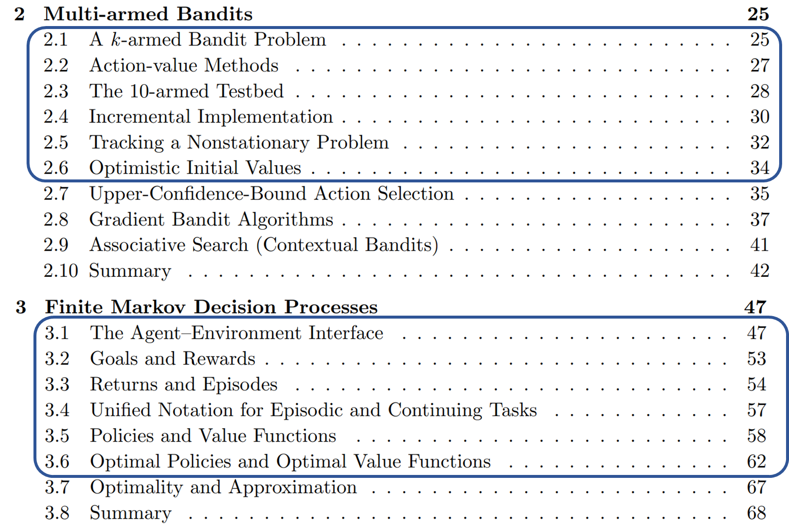

# Ch2. Multi-armed Bandits

- 다른 형태의 learning과 RL을 구분하는 가장 큰 특징
    - 올바른 행동을 지시하는 것이 아니라 취한 **행동을 평가**하는 Training Information을 사용
- Instructive Feedback 과 evaluative Feedback의 차이
    - evaluative feedback은 얼마나 action이 좋았는지 평가, best나 worst를 나타내지 않음
    - Instructive feedback은 실제로 취한 action과는 독립적으로, 올바른 action이 뭔지 feedback
        - e.g. 지도학습
- 이번 챕터에서는,
    
    Evaluative Feedback만이 포함된 간소화된 상황에서의 강화학습의 평가적 측면을 살펴볼 것 
    

# 2.1 ) K-armed Bandit Problem

- 비연관성(**nonassociative**) Evaluative feedback problem의 예시로서 살펴볼 것
- 기본적인 학습 방법을 살펴보고, 이후 챕터에서 확장하여 전체 강화학습 문제에 적용
- 마지막 부분에서는, 밴딧문제가 **연관성을 가지는 상황**으로 바뀔 때,
    
    즉, **최선의 행동이 상황에 따라 다른 경우**를 논의하며 전체 강화학습 문제로 나아갈 것 
    

---

- k개의 옵션이나 행동 중에 하나를 반복해서 선택해야함
    - 선택 후에는, 정적확률분포에 따라 선택된 수치적 reward를 받음
- 목표는 Maximize Expected Total Reward
- Value
    
      :   k개의 행동 중 하나를 선택할 때, 선택된 행동에 뒤따르는 보상 or 평균 보상 
    

$A_t$ : time step t에서 선택된 행동

$R_t$ : 이에 해당하는 Reward 

$q_*(a)$ : 임의의 행동 a의 가 선택되었을 때, 예상되는 보상 (Reward의 평균)

$Q_t(a)$ : time step $t$  에서 action $a$ 를 했을 때 평가된 value

- Exploitation 만 지독하게 하면 Greedy search

---

# 2.2 ) Action-value Methods

> Q값을 어떻게 계산할 것이냐
> 
- true vlaue :  action이 선택되었을 때, 이들의 평균 reward
- 자연스러운 방법 : 실제로 받은 reward를 평균내는 것

→ $A_i = a$ : true 이면 1, false면 0

분모가 0 → $Q_t(a)$ 를 defalut 값으로 → e.g. 0 

분모가 $\infty$ → $Q_t(a) → q_*(a)$ $\because$  큰수의 법칙 

위와 같은 방법을 `sample-average method` 라고 함 

## action을 어떻게 선택 ?

- 가장 간단한 방법은 매 step마다 최선이라고 생각되는 action을 greedy 하게 선택하는 것
- `Greedy action selection method`
    
    
    
- 또 다른 대안은 작은 확률 $\epsilon$ 으로 무작위의 action을 선택하는 것 $\epsilon$-greedy method

<aside>
💡 단계 수가 증가함에 따라서, 무한히 샘플링되고

결론적으로는 모든 $Q_t(a)$ 가 $q_*(a)$ 로 수렴하지만

단순히 점근적인 관점에서의 보장이며, 실제적인 효과는 보장하지 않음 

</aside>

> Ex 2.1 ) $\epsilon$-greedy method 에서, $\epsilon$ = 0.5라면, greedy action이 선택될 확률 ?
> 
> 
> →0.5 
> 

---

# 2.3 ) The 10-armed Testbed

- k = 10 , 즉, 선택지가 10개, 선택할수 있는 action이 10가지

- 가우시안 분포를 가정 (평균0, 분산1)
- time-step t 에서 action $A_t$ 를 선택할 때, 실제 보상 $R_t$ 는
    
    평균이 $q_*(a)$ 이고 분산이 1인 정규분포에서 선택됨 
    

- 그림에서는 잘 보이진 않지만, 처음에는 greedy method가 빠르게 학습했다고 함
    - 하지만, 그림에서 볼 수 있듯이, 나중에는 더 낮은 수준에서 수렴함
    - $\epsilon$ = 0.1 일 때, 최대는 1.54인데, greedy는 1정도
    - 결국, greedy정책은  장기적으로는 성능이 좋지 않음
        - 뿐만 아니라, $\frac{1}{3}$ 에서만 optimal action을 함
- $\epsilon$ = 0.01 인 경우, 천천히 개선되었지만, 결국에는 $\epsilon$ = 0.1 인 경우보다 좋은 퍼포먼스를 냄 (그림에는 안보임)

<aside>
❓ 그렇다면 Epsilon-greedy가 greedy정책보다 항상 좋냐 ?

→  **Task에 따라 다르다  !**

> 분산이 큰 경우를 생각해보자
> 
> - Reward의 분산이 1이 아니라 10이라고 생각해보면
>     - Reward에 noise가 있는 경우, $\epsilon$-greedy가 더 많은 탐색을 할 것이므로 유리
> 
> 하지만 분산이 0이라고 생각해보면 
> 
> - Greedy방법은 한번 시도해본 후 , action의 실제 값이 알려지게됨
> - 최적의 action을 빠르게 찾고 그 이후로는 탐색하지 않아서 greedy가 더 나을수도
</aside>

---

# 2.4 ) Incremental Implementation

- action-value 추정을 업데이트 하는 과정에서,
    
    **이전 추정치를 재사용**하고 **추가정보를 이용**하여 **효율적으로 계산**하는 방법 
    
    - 이를 통해 상수 메모리와 상수 시간 단계의 계산 가능
    
    
    
- $Q_n$ 은 action value의 추정치, 이전 Reward 들의 평균
- 매번 계산하기엔 memory도 많이 필요하고 연산도 비효율적임
- 따라서 아래와 같이 재귀적으로 표현 가능
    
    
    
    - 결론적으로, n번째 step에서의 Q,R값만 알면 추정치 예상 가능 (평균의 재귀식)
- 조금 더 일반화시켜 표현해보면
    
    
    
    - $`Target - OldEstimate`$ : Error
- simple bandit algorithm with $\epsilon$-greedy action selection
    
    
    

---

# 2.5 ) Tracking a Nonstationary Problem

- 지금까지 살펴본 밴딧 문제는 Stationary 한 (정적인) 밴딧 문제들 ..
    - Reward의 확률이 시간에 따라 변화하지 않음
- Nonstationary  problem은 시간에 따라 Reward확률이 달라짐
    - 따라서, 최근 Reward에 더 가중치를 주어 추정치를 계산하는 것이 합리적임
    - 반대로 이야기하면,
     시간이 오래 지나서 현재의 Reward확률을 반영하지 못하는 것들의 가중치를 줄이는 것
    - 이런 방식으로, Nonstationary 한 문제에 대해서도 추정치를 효과적으로 업데이트 가능
- 이전의 추정치 식을 약간 변경함으로써, 이를 반영 가능
    - 이전의 식 ( 평균의 재귀식 )
        
        
        
    - constant step-size parameter $\alpha$ 사용
        
        
        
        - $\alpha$ → (0,1] 사이의 상수
        
    - 이를  $Q_1$ 의 관점에서 식을 다시 풀어 써보면
        
        
        
        - `weighted-average` 라고 부름 ( $\because (1-\alpha)^n + \sum {\alpha(1-\alpha)^{n-i}} =1$ )
        - step 에 따라서 $(1-\alpha)$ 의 지수로 감소하기 때문에
            
            `recency-weighted average`라고도 함 
            
- 가끔은 step마다 alpha를 다르게 가져가는게 편할 때도 있음  $\alpha_n(a)$
    - sample-average method 로 치면,  $\alpha_n(a)=\frac{1}{n}$
    - 위의 경우에는 큰수의 법칙에 따라, $q_*$ 의 수렴을 보장하지만,
        
        $\alpha_n(a)$ 의 선택에 따라 수렴성을 보장하지 못할수도 
        
- 그렇다면 확률 1로 수렴하기 위해 필요한 조건은 ?
    
    
    

1. 충분히 큰 Step을 가져야함
    
    (초기조건이나 랜덤성을 극복하기 위해서)
    

1. 스텝이 충분히 작아져서 수렴을 보장

- sample-average인 경우, $\alpha_n(a)=\frac{1}{n}$ → 위의 식 만족
- 그렇지 않고 상수인 경우, $\alpha_n(a)=\alpha$  → 조건2가 만족하지 않음 (not bounded)
    - 결국, 추정값이 완전히 수렴하지 않고, 최근에 받은 보상에 대해 반응
    - 하지만, NonStationary한 문제에 대해서는 바람직한 결과
    - 실제로 강화학습 문제는 Nonstationary한 문제가 일반적

---

# 2.6 ) Optimistic Initial Value

- 지금까지 논의한 모든 방법은 초기 추정치 $Q_1(a)$ 에 어느 정도 의존적임
    
    
    
    - 통계학적인 용어를 빌리면, **초기 추정값에 의해 편향되어있음**
        - sample-average의 경우, 적어도 한번 씩 선택되면 편향은 사라지지만,
        - $\alpha$ 를 사용하는 경우, 위의 식에서 볼 수 있듯이 편향은 영구적임
            
            (단, 시간에 따라 감소) 
            
        - 물론 이러한 편향이 나쁘다고 할 순 없음 (가끔은 매우 유용)
        - 단점은 초기 추정값이 사용자가 선택해야 하는 매개 변수 집합이라는 것
        - 하지만 어떤 수준의 보상을 기대할 수 있는지에 대한 일종의 사전 지식을 제공
- Initial action value는 Exploration을 독려하는 간단한 방법으로도 사용될 수 있음
    - 10-armed testbed에서, initial action value를 0대신 +5 로 설정한다고 가정
        - $q_*(a)$ 가 normal distribution (평균0,분산1)에서 선택된다는 점을 고려하면
            
            아주 낙관적인 setting  
            
        - 하지만 이런 세팅은 action-value method가 더 탐색하게 함
        - 어떤 action이 처음에 선택되든지, reward는 처음의 추정값보다 낮을 것이고
            
            learner는 받는 reward에 실망할 것이고 다른 action들로 switching할 것 
            
        - 결과적으로는 가치추정이 수렴하기 전에, 모든 action들이 시도되고
            
            greedy action이더라도 시스템은 상당한 수준의 exploration을 함 
            
            
